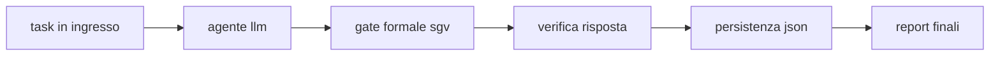
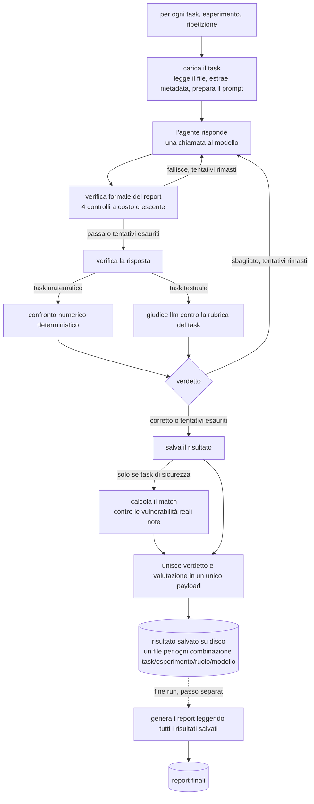
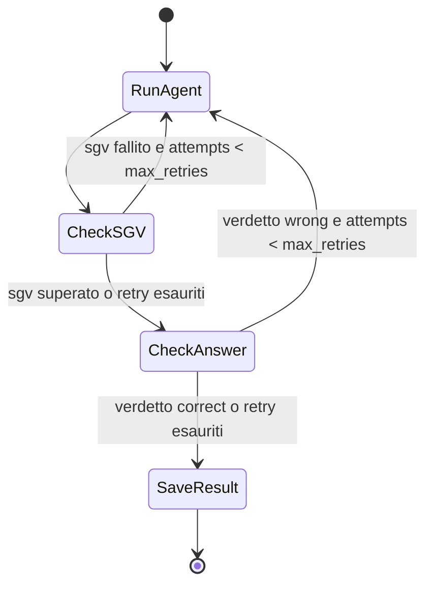
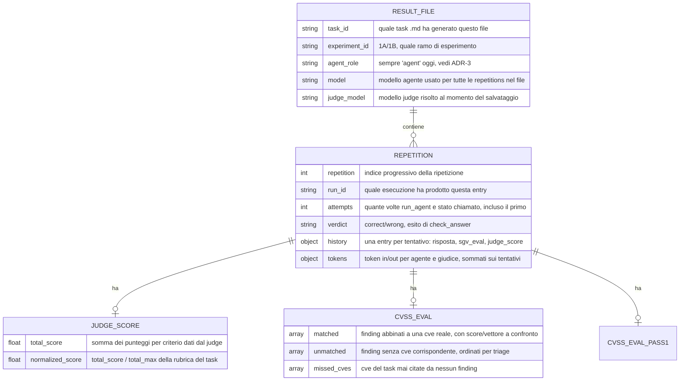
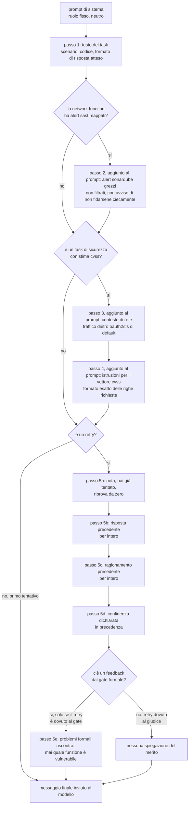
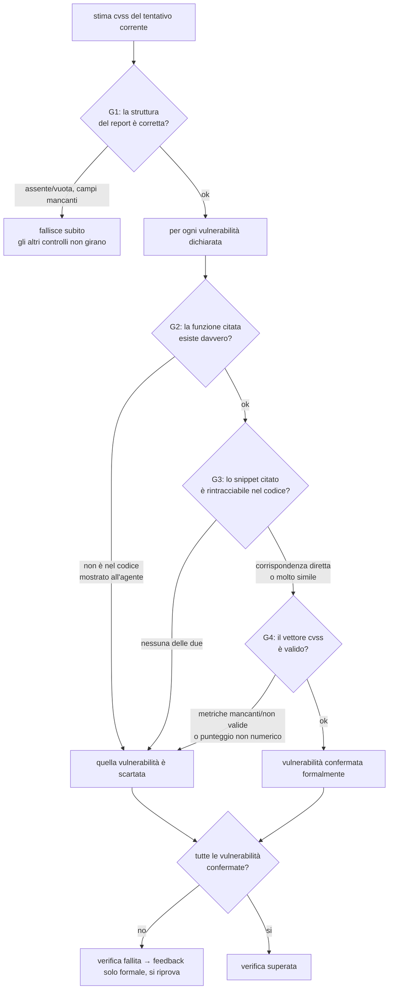
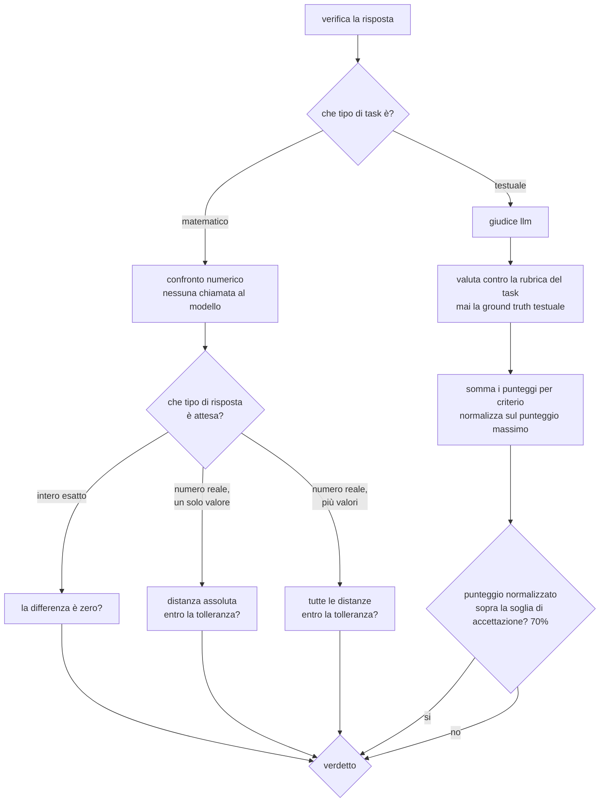
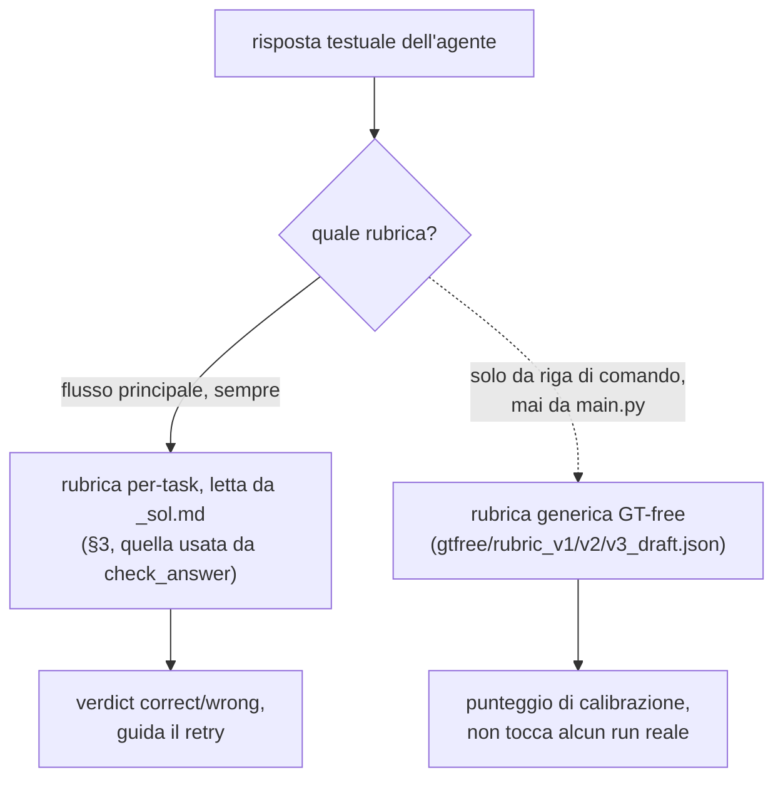
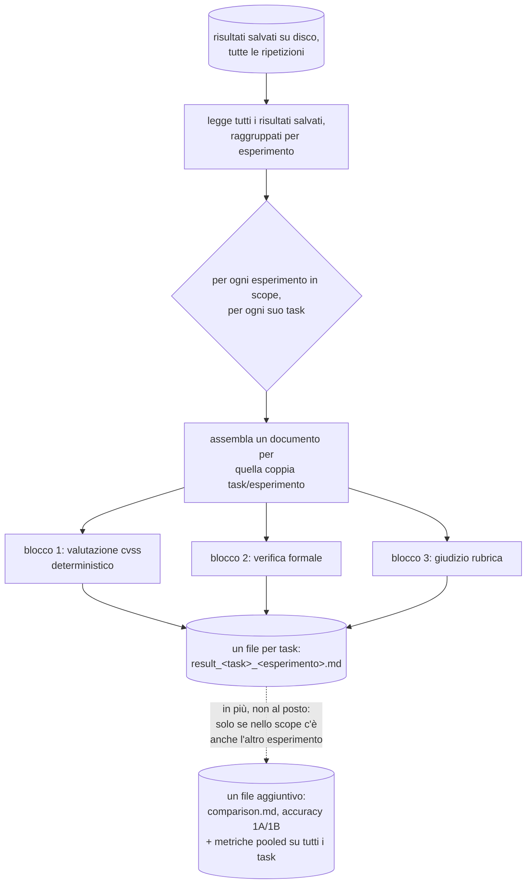
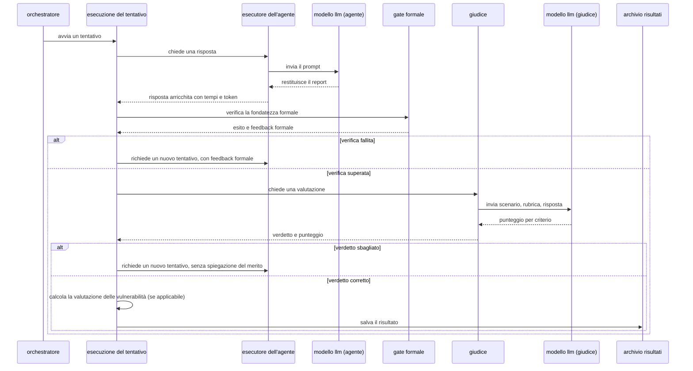

# Mappa del sistema

> Documento "code-as-truth": fonte esclusiva codice sorgente + git log/blame/show. Formato Mermaid/ADR, distinto da `codemap/flusso.md` (prosa minimale) e da `codemap/00_indice.md`/`narrativa/` (dettaglio per modulo). Questo file mappa pipeline, decisioni e domande aperte in un unico documento.

## Panoramica

> Questo documento copre solo il ramo di analisi statica del codice (questo repository). Il ramo di analisi dinamica/Digital Twin, che studia il comportamento della rete a runtime, è un sistema separato e non è coperto qui.

Il sistema esegue un esperimento multi-agente: un LLM ("agent") analizza un task (matematico o di security review su codice Go di free5GC), un gate deterministico verifica la fondatezza formale del report prodotto, un secondo LLM ("judge") o un controllo matematico ne valuta la correttezza con retry automatico; per i task di sicurezza, una pipeline Python separata calcola inoltre metriche di detection/severità confrontando i finding dichiarati contro un dataset di CVE reali. Tutto è orchestrato da un grafo LangGraph invocato da `main.py` per ogni combinazione task × esperimento × ripetizione, con persistenza su JSON e reportistica Markdown aggregata in un passo successivo separato.

## Pipeline

### Vista d'insieme (livello blocchi)



> [!NOTE]
> Questa vista serve solo come canovaccio ("di cosa sto parlando adesso"). Ogni blocco è approfondito in un diagramma dedicato in "Approfondimenti per blocco" più sotto, **nello stesso ordine del flusso**: (1) come si costruisce il prompt, (2) il gate SGV, (3) check_answer, (4) dalla persistenza al report. Non aggiunge informazione rispetto al diagramma di flusso completo qui sotto, lo introduce.

### Flusso principale (per ripetizione)



- **`load_task`**: legge il file `.md` del task, estrae metadata (`**ID:**`/`**Tipo:**`), ground truth, rubrica; arricchisce il prompt con hint SAST e/o istruzioni CVSS se i flag di `config.py` lo richiedono.
- **`run_agent`**: unica chiamata LLM per tentativo, un solo ruolo (vedi ADR-3).
- **`check_sgv`**: quattro controlli deterministici a costo crescente (schema, esistenza simbolo, groundedness snippet, validità vettore CVSS), vedi ADR-1/ADR-2. Nessun accesso alla ground truth.
- **`check_answer`**: matematico → confronto numerico; testuale → Judge LLM contro la rubrica *del task* (non generica, non basata su ground truth testuale).
- **`save_result`**: qui avviene il merge, se il task è CVSS-abilitato calcola prima `evaluate_cvss_estimate` (Ramo B, deterministico), poi scrive un unico payload con verdetto + valutazione CVSS nello stesso file JSON.
- **`evaluation_utils.py`**: passo separato (non nel grafo), legge tutti i JSON già scritti e produce i report Markdown finali.

### Macchina a stati del retry



> [!NOTE]
> Il contatore `attempts` è unico e condiviso tra i due punti di retry (fallimento SGV e verdetto "wrong"). Non esistono due budget separati. Fonte: `utils/experiment_utils.py:282-290` (`_route_after_sgv`) e `:453-461` (`_route_after_check`), entrambi confrontano lo stesso campo `attempts` contro `config.MAX_RETRIES` (`config.py:44`, valore 3).

### Schema dati persistito



> [!NOTE]
> Fonte: `utils/experiment_utils.py:379-421` (`_save_result`, costruzione di `rep_payload` e `payload`). Un file JSON = una combinazione `task_id`/`experiment_id`/`agent_role`/`model`; contiene una lista `repetitions`, appesa a ogni run successivo sullo stesso file. `CVSS_EVAL_PASS1` ha la stessa struttura di `CVSS_EVAL` ma calcolata sul primo tentativo (`history[0]`) invece che sull'ultimo, per confrontare la detection prima/dopo il retry loop.

## Approfondimenti per blocco

> Diagrammi isolati per i punti dove il flusso principale nasconde più dettaglio di quanto un solo nodo lasci intuire, **ordinati come il flusso di esecuzione** (load_task → check_sgv → check_answer → report), così si possono seguire in sequenza senza saltare avanti e indietro. Ognuno risponde a una domanda specifica invece di sovraccaricare il diagramma di flusso principale.

### 1. Come si costruisce il prompt inviato al modello (`load_task` + assembly)



Tutti i passi 5a-5e sono costruiti in una sola operazione: il codice concatena queste sezioni testuali, ciascuna con la propria intestazione, non un riassunto. L'agente al retry legge letteralmente la propria risposta precedente completa (fonte in tabella).

| Passo | Sempre presente? | Da dove viene | Contenuto |
|---|---|---|---|
| System prompt | sì | `agents/prompts.py:SYSTEM_PROMPTS["agent"]` | un ruolo neutro fisso (vedi ADR-3) |
| 1. Task grezzo | sì | file `.md` del task, letto verbatim | scenario + codice + formato di risposta atteso |
| 2. Hint SAST | solo se `config.SAST_HINT_ENABLED` e la Network Function ha alert mappati | `utils/sast_hint.py` | alert SonarQube grezzi, non curati, con avviso esplicito di non fidarsi ciecamente |
| 3. Contesto NF | solo se task CVSS | `agents/prompts.py:NF_CONTEXT_HINT` | avviso che il traffico SBI gira dietro OAuth2/TLS di default, per non sovrastimare l'impatto |
| 4. Istruzioni CVSS | solo se task CVSS | `utils/cvss_utils.py:inject_cvss_instructions` | formato esatto delle righe `function`/`vector`/`score`(/`snippet`) richieste |
| 5a. Nota di retry | solo dal secondo tentativo in poi | testo fisso in `build_retry_task_content` | "hai già tentato, riprova da zero" |
| 5b. Previous Answer | solo dal secondo tentativo in poi | `history[-1]["answer"]`, formattata da `_format_previous_answer` | la risposta strutturata data dal tentativo precedente, per intero |
| 5c. Previous Reasoning | solo dal secondo tentativo in poi | `history[-1]["reasoning"]` | il ragionamento testuale del tentativo precedente, per intero |
| 5d. Previous Confidence | solo dal secondo tentativo in poi | `history[-1]["confidence"]` | la confidenza dichiarata dal tentativo precedente |
| 5e. Formal Issues Found | **solo se il retry è scattato per un fallimento SGV** (mai per un verdetto "wrong" da rubrica/math) | `sgv_feedback`, prodotto da `run_sgv` | elenco dei check G2/G3/G4 falliti, esplicitamente mai il nome della funzione vulnerabile |

> [!NOTE]
> Fonte primaria dell'ordine 1-4: il docstring in testa a `agents/prompts.py:1-30`. Fonte del dettaglio 5a-5e: `utils/experiment_utils.py:191-219` (`build_retry_task_content`). L'asimmetria del passo 5e (presente solo per fallimento SGV, mai per verdetto di rubrica/math) è la stessa discussa in `codemap/flusso.md` §5: un retry causato dal giudice non riceve mai una spiegazione di cosa fosse sbagliato nel merito.

### 2. Il gate SGV (G1→G4) in dettaglio: cosa verifica ognuno



| Check | Cosa verifica | Soglia/logica | Se fallisce |
|---|---|---|---|
| G1: schema | `cvss_estimate` non vuoto, niente marcatore `_raw` (parsing fallito a monte), `findings` lista non vuota, campi `function`/`vector`/`score` (+`snippet` se richiesto) presenti | binario, nessuna soglia | blocca tutto il report, G2-G4 non girano |
| G2: simbolo | il *nome* della funzione citata esiste (case-insensitive) tra quelle estratte dai blocchi ` ```go ` mostrati all'agente, non dalla ground truth: non controlla il codice, solo che il riferimento non sia inventato | containment su un insieme di nomi | quel finding è marcato fallito |
| G3: groundedness snippet (opzionale, `config.SGV_SNIPPET_ENABLED`) | il *contenuto* dello snippet citato è davvero presente nel sorgente, non solo il nome della funzione: impedisce di parafrasare o inventare codice pur citando una funzione reale | due livelli in cascata: 1) sottostringa esatta dopo normalizzazione whitespace/punteggiatura; 2) se fallisce, similarità Jaccard sui token tra lo snippet e finestre scorrevoli di 1-3 righe consecutive del sorgente, soglia `config.SGV_SNIPPET_JACCARD_THRESHOLD=0.8` | quel finding è marcato fallito |
| G4: vettore CVSS | `vector` è una stringa parsabile con tutte le metriche richieste valide, `score` è numerico | delega la validità a `cvss_eval._parse_vector` | quel finding è marcato fallito |

> [!NOTE]
> Il report fallisce nel complesso se **anche un solo finding** fallisce G2/G3/G4 (AND su tutti i finding). Il feedback restituito elenca quale check è fallito per quale finding, ma non dice mai quale funzione sia effettivamente vulnerabile. Fonte: `utils/sgv.py:220-225` (costruzione del messaggio di feedback).
>
> **G2/G3 sono controlli sintattici, non semantici.** G2 verifica solo che il nome della funzione citata esista tra quelle mostrate all'agente (containment testuale su un insieme di nomi), G3 verifica solo che il contenuto dello snippet sia rintracciabile nel sorgente (sottostringa, poi similarità Jaccard sui token). Nessuno dei due valuta se la vulnerabilità descritta abbia senso o sia reale, quella valutazione è demandata al giudice LLM in `check_answer` (§3), che resta comunque una valutazione implicita (il modello legge e giudica in linguaggio naturale, senza una struttura formale di concetti/relazioni sottostante). Nel codice non esiste oggi un controllo semantico esplicito nel senso di un'ontologia o un knowledge graph che vincoli formalmente cosa un finding può o non può affermare, e nemmeno un fallback LLM dentro G3 (deliberatamente non aggiunto, ADR-2).

### 3. `check_answer`: matematico vs testuale, e come è fatta la rubrica



La rubrica di un task testuale è definita nel secondo blocco JSON del file `_sol.md` del task (`utils/task_utils.py:58`), con questa struttura (esempio reale, `docs/tasks/task3_anomaly_sol.md`):

```json
{
  "rubrica": {
    "classification_score": {
      "max": 3,
      "criteri": {
        "3": "Classifies CRITICAL_ANOMALY with justification citing at least 3 out-of-threshold parameters",
        "2": "Classifies CRITICAL_ANOMALY but with partial justification (1-2 parameters)",
        "1": "Classifies MINOR_ANOMALY with plausible technical justification",
        "0": "Classifies NORMAL or provides no technical justification"
      }
    },
    "reasoning_score": { "max": 3, "criteri": { "...": "..." } },
    "clarity_score": { "max": 1, "criteri": { "...": "..." } }
  },
  "total_max": 7
}
```

| Campo | Significato |
|---|---|
| `rubrica.<criterio>.max` | punteggio massimo ottenibile su quel criterio |
| `rubrica.<criterio>.criteri` | mappa punteggio→descrizione testuale di cosa merita quel punteggio (usata per costruire il prompt del judge, `utils/experiment_utils.py:build_judge_prompt`) |
| `total_max` | somma dei `max` di tutti i criteri, usata per normalizzare (`normalized_score = total_score / total_max`) |

> [!NOTE]
> Il judge riceve: scenario del task (istruzioni per l'agente rimosse), la rubrica sopra, e la risposta dell'agente; mai la ground truth testuale del task. Fonte: `agents/judge_agent.py:_build_judge_payload_markdown` (righe 72-85).

### 4. La rubrica GT-free: un secondo giudice, isolato dal flusso principale



Nel codice esistono **due giudici a rubrica separati**, non uno con due modalità. Quello del flusso principale è quello già descritto in §3: rubrica specifica del task, letta da `_sol.md`, sempre attiva, guida il retry. L'altro vive solo dentro `scripts/judge_calibration/run_gtfree_rubric.py`: riusa lo stesso motore di giudizio (`run_judge_textual`/`build_judge_prompt`) ma con una rubrica generica, task-independent, letta da file esterno invece che dal task (`RUBRIC_PATH` di default punta a `docs/judge_rubric/gtfree/rubric_v1.json`, `scripts/judge_calibration/run_gtfree_rubric.py:44`; una seconda e terza versione esistono come `rubric_v2_draft.json`/`rubric_v3_draft.json`, selezionabili solo col flag `--rubric`). Nessun file `.py` del flusso principale (`main.py`, `utils/experiment_utils.py`) importa o richiama questo script: è verificabile per grep, zero riferimenti a `gtfree` fuori da quel singolo file.

> [!NOTE]
> Questa è quindi una traccia di calibrazione/ricerca parallela, non una funzionalità del sistema in produzione: chi si aspetta di trovarla nel loop di retry non la troverà. Fonte del perché esiste e di come si è evoluta: ADR-11. Per la situazione attuale in dettaglio (contesto, banco di prova, risultati v1/v2/v3, perché v2 resta la migliore ma non basta a sostituire la rubrica del flusso principale) vedi `docs/judge_rubric/15_stato_attuale_gtfree.md`, fuori da questa cartella perché si basa su risultati sperimentali, non solo sul codice.

### 5. Dalla persistenza al report: come nasce un file Markdown



> [!NOTE]
> **"Esperimento" e "task" sono due assi indipendenti, non alternativi.** Un esperimento (`1A`, `1B`, ...) identifica *quale coppia di modelli* è stata usata per agente e giudice (`config.MODELS`, es. `1A` = stesso modello per entrambi, `1B` = modelli diversi); un task (`task1_math_int`, `task5_vuln_pcf`, ...) identifica *quale problema* è stato sottoposto all'agente. Ogni ripetizione salvata su disco appartiene a una sola coppia (task, esperimento). Fonte: `config.py:11-24`, `docs/status.md`.
>
> Il ciclo esterno su ogni esperimento nello scope (default: entrambi `1A`/`1B`, ma `1B` produce zero file oggi perché `docs/status.md` nota che il loop principale di `main.py` non genera più dati per `1B`) e quello interno sui suoi task **girano sempre**, per ciascun esperimento indipendentemente dall'altro: è qui che nascono i `result_<task>_<esperimento>.md`, uno per ogni task che ha almeno un risultato salvato. `comparison.md` **non è un ramo alternativo**: è un file in più, scritto una sola volta *dopo* che entrambi i cicli sopra sono già stati completati, e appare solo se lo scope includeva sia `1A` sia `1B` (altrimenti non ha nulla da confrontare). Fonte: `utils/evaluation_utils.py:1954-2047` (`_write_evaluation_reports`).
>
> Questo passo **non fa parte del grafo LangGraph**: gira separatamente, tipicamente a fine run o su comando a parte (`python -m utils.evaluation_utils`), e legge l'intero insieme dei JSON già scritti, non uno alla volta mentre l'esperimento procede. Fonte: `utils/evaluation_utils.py:1954` (`_write_evaluation_reports`) e l'ordine dei blocchi B→C→A discusso in ADR-6.

### 6. Le metriche del blocco CVSS (M1-M5, S1-S3): cosa misurano

> Questa sezione dà solo le definizioni, ancorate al codice che le calcola: cosa ciascuna metrica misura e da dove viene. Per l'interpretazione estesa (come leggerle insieme, casi degeneri, trappole di lettura già incontrate, con numeri reali da run passati) la fonte è `docs/sgv_protocol/08_guida_metriche.md`, che non è ripetuta qui perché nasce da un'analisi di risultati, non dal solo codice.

Ogni finding dichiarato dall'agente finisce in una di tre categorie rispetto alla ground truth CVE del task, calcolate dal Ramo B (`evaluate_cvss_estimate`, vedi ADR-5): **matched** (associato a una CVE, TP), **unmatched** (nessuna CVE corrispondente, FP), oppure la CVE resta **missed** se nessun finding la copre (FN). Il matching è deterministico per nome funzione, first-match (ADR-8). Da qui:

| Metrica | Cosa misura | Fonte nel codice |
| --- | --- | --- |
| M1 (detection rate, coverage) | Quota di ripetizioni con almeno una CVE trovata; frazione media di CVE target trovate per ripetizione | `utils/evaluation_utils.py::_build_detection_metrics_section` |
| M2 (precision, recall, F1) | Precisione e completezza sui totali pooled TP/FP/FN | stessa funzione, sui totali aggregati |
| M3 (alerts/TP) | Quanti finding bisogna leggere in media per ogni vulnerabilità vera trovata, (TP+FP)/TP | stessa funzione |
| M4 (delta SAST) | Non implementata: richiederebbe un secondo tool SAST reale sullo stesso codice per un confronto diretto | assente dal codice |
| M5 (costo) | Tempo e token per ripetizione (agente + giudice), media sui retry inclusi | `_build_cost_metrics_section` |
| S1 (match esatto vettore) | Quota di TP il cui vettore CVSS stimato coincide campo per campo col vettore pubblicato | `_build_severity_metrics_section` |
| S2 (accuratezza per metrica + distanza ordinale) | Per ciascuna delle 11 metriche CVSS (AV, AC, AT, PR, UI, VC, VI, VA, SC, SI, SA): quota di match esatti e distanza media sulla scala ordinale | stessa funzione |
| S3 (baseline vettore modale) | Punteggio di un modello nullo che risponde sempre il vettore più frequente tra le CVE target in scope, come termine di paragone per S1/S2 | stessa funzione |

Le metriche S esistono solo sui TP (non c'è nulla da confrontare per unmatched/missed) e sono calcolate solo sulla risposta finale, non sul primo tentativo. Le metriche M invece si leggono anche in coppia `final answer`/`first attempt` (ADR-9), per isolare l'effetto del retry.

> [!WARNING]
> Non esiste nel codice un concetto di "vero negativo" (TN): non c'è un universo finito di non-vulnerabilità da contare, quindi niente accuracy/specificity in senso classico. Un finding "unmatched" non equivale a "falso": può essere una vulnerabilità reale senza CVE catalogata nel dataset di riferimento. La precisione calcolata è quindi strutturalmente un limite inferiore, non un valore assoluto.

### 7. Sequenza di chiamate (agente, gate, giudice, persistenza)

> [!NOTE]
> Tenuto per completezza ma non nel percorso di lettura principale: è la stessa informazione dei punti 1-5 sopra, vista come sequenza di chiamate invece che come diagramma di flusso. Utile solo se serve ragionare esplicitamente sull'ordine temporale delle chiamate (es. per debugging o per spiegare la latenza).



## Decisioni architetturali

### ADR-1: Gate sintattico deterministico (SGV) prima del giudizio

- **Contesto**: serviva un modo per verificare che il report dell'agente fosse formalmente fondato (funzione citata esistente, snippet reale, vettore CVSS valido) prima di sottoporlo a un giudizio più costoso, senza usare la ground truth.
- **Decisione**: implementati quattro controlli (G1 schema, G2 esistenza simbolo, G3 groundedness snippet opzionale, G4 validità vettore) come nodo `check_sgv` nel grafo, indipendente dal retry basato su rubrica, con feedback puramente formale.
- **Fonte**: commit `02603a0`: *"Implement SGV G1-G4 (deterministic in-loop gate, no ground truth)... Wired as a new check_sgv node in the LangGraph retry loop, independent of the rubric judge retry, with purely formal feedback on failure."*

### ADR-2: Nessun fallback LLM per il controllo G3 (groundedness snippet)

- **Contesto**: la prima run reale (task5-9, 1A, 15 casi) ha mostrato due bug in G3/G2, nessuno dei due dovuto ad allucinazione del modello.
- **Decisione**: corretta la normalizzazione whitespace e il confronto a finestre multi-riga (Jaccard); **deliberatamente non aggiunto** un fallback LLM per rendere G3 più tollerante.
- **Fonte**: commit `5d97f35`: *"Deliberately not adding an LLM fallback level for G3, this would reintroduce the non-reproducibility/leakage/cost the SGV exists to avoid in the loop."*

### ADR-3: Unificazione dei ruoli agente (expert/beginner → ruolo singolo)

- **Contesto**: esisteva una distinzione di ruolo (expert/beginner) nel prompt dell'agente.
- **Decisione**: unificata in un singolo ruolo neutro (`SYSTEM_PROMPTS["agent"]`), rimosso il flag `--role` da `main.py`, il campo `agent_role` resta nello schema con valore fisso `"agent"` per compatibilità con i risultati vecchi.
- **Fonte**: commit `b7fea95`: *"Unify expert/beginner into a single agent (call 11 simplification)... agent_role kept in state/JSON with value 'agent': schema, reports and aggregation untouched, old per-role results still readable."*

### ADR-4: Tagging `run_id` per una reportistica run-scoped

- **Contesto**: il nome della cartella di ruolo era l'unico modo per distinguere run diverse sullo stesso task/esperimento; nessun campo nel JSON indicava a quale run appartenesse un risultato, e la distinzione avveniva con rinomine manuali di cartelle.
- **Decisione**: ogni ripetizione salvata in una singola invocazione di `main.py` viene taggata con un `run_id` (timestamp UTC automatico, o etichetta custom via `--run-id`); aggiunto filtro `run_id` opzionale e comando `--list-runs` in `evaluation_utils.py`.
- **Fonte**: commit `900340f`: *"Root cause of the doc-07 confusion: role-folder name was the only thing separating different runs... Folder renames (agent_8m, agent_run4) were manual bookkeeping that worked until it didn't."*

### ADR-5: Valutazione CVSS deterministica (Blocco B) separata dal verdetto

- **Contesto**: serviva un secondo canale di misurazione delle vulnerabilità trovate, senza introdurre un secondo giudizio LLM che potesse influenzare il retry.
- **Decisione**: `evaluate_cvss_estimate` calcola matching e score contro il dataset CVE in modo interamente deterministico (Python + libreria CVSS ufficiale), *senza mai toccare* `verdict`.
- **Fonte**: commit `21cb72a`: *"Agents on vuln tasks now emit a structured CVSS 4.0 estimate, matched and scored deterministically against the CVE dataset without touching the rubric verdict."* Confermato nel codice: `utils/experiment_utils.py:364` (commento "never affects verdict").

### ADR-6: Ordine dei blocchi nel report finale: B → C → A

- **Contesto**: il report generato da `evaluation_utils.py` conteneva più sezioni (CVSS deterministico, SGV, giudizio rubrica) in un ordine che non facilitava la lettura.
- **Decisione**: riordinati i blocchi: Blocco B (CVSS, deterministico) apre il report, Blocco C (SGV) segue, Blocco A (giudizio LLM/rubrica) chiude; dentro il Blocco B, il dettaglio per-finding precede i roll-up aggregati.
- **Fonte**: commit `74963d8` + commento in `utils/evaluation_utils.py:1897-1900`: *"Block order (2026-07-16 feedback): Blocco B (deterministic CVSS metrics) leads the report, Blocco C (SGV) follows, Blocco A (LLM-judge rubric)..."*

### ADR-7: Media micro (pooled) e macro (per-task) per le metriche di detection

- **Contesto**: la media pooled (micro) delle metriche M1-M3 poteva essere dominata per volume da un singolo task rumoroso.
- **Decisione**: aggiunta una media macro (semplice per-task, peso uguale), che esclude i task senza CVE mappata; mostrata solo con almeno 2 task pooled.
- **Fonte**: commento in `utils/evaluation_utils.py` (introdotto nel commit `96285e3`): *"unlike the micro-average headline row above, where a noisy task (e.g. UDM, more than a third of all pooled FP) dominates the pooled count simply by volume (relatore feedback 2026-07-21)."*

### ADR-8: Matching finding↔CVE per nome funzione, first-match, senza tie-break GT-aware

- **Contesto**: quando un agente cita la stessa funzione più volte nella stessa ripetizione, serviva un criterio per decidere quale occorrenza abbinare alla CVE di ground truth.
- **Decisione**: matching per containment sul nome funzione (case-insensitive), semantica *first-match* in ordine di output dell'agente; nessun tie-break che scelga il duplicato "più vicino" al vettore GT.
- **Fonte**: commento in `utils/cvss_eval.py:165`: *"the closest vector) would leak the GT into the pairing and bias S upward."*
- **Nota**: il caso che rende questa scelta rilevante (stesso handler citato più volte nella stessa ripetizione) non è un edge case teorico, è un pattern ricorrente e concentrato su pochi handler (in prevalenza lato AMF). Per l'analisi quantitativa aggiornata, non adatta a stare qui perché dipende da dati non versionati, vedi `docs/findings.md` F23.

### ADR-9: Rinomina "pass@1/pass@k" → "first attempt/final answer"

- **Contesto**: la terminologia "pass@k" nel report suggeriva erroneamente un campionamento best-of-k indipendente, mentre il sistema produce una singola risposta finale dopo un retry loop sequenziale.
- **Decisione**: rinominate le metriche/etichette nel report da pass@1/pass@k a "first attempt"/"final answer".
- **Fonte**: commit `856d969` (*"Revised detection metrics section to reflect changes from pass@1/pass@k to final answer vs first attempt, improving clarity on evaluation methodology"*) + commento in `utils/evaluation_utils.py:596-598`.

### ADR-10: Intervallo di confidenza al 95% con distribuzione t di Student

- **Contesto**: la variabilità run-to-run di TP/FP viene misurata su poche ripetizioni (tipicamente n=3).
- **Decisione**: usato il t di Student (df = n−1) invece dell'approssimazione normale per calcolare il CI95%.
- **Fonte**: commento in `utils/evaluation_utils.py:850`: *"(Student's t, df = n−1) of the TP and FP counts across the..."* (approssimazione normale sarebbe stata troppo ottimistica con n piccolo).

### ADR-11: Rubrica GT-free tenuta come traccia di calibrazione separata, mai promossa nel flusso principale

- **Contesto**: la rubrica del giudice nel flusso principale è scritta a partire dalla ground truth del task (§3); l'obiettivo dichiarato del gruppo era verificare se un giudizio a rubrica generica, senza GT, potesse arrivare a un livello di affidabilità comparabile.
- **Decisione**: tre versioni di rubrica GT-free sono state implementate e testate (`gtfree/rubric_v1.json`, poi v2, poi v3) contro lo stesso banco di prova C1/C2, ma tenute isolate in `scripts/judge_calibration/run_gtfree_rubric.py`, mai importate né richiamate dal flusso principale (`main.py`/`utils/experiment_utils.py`).
- **Fonte**: commit `e0f76ec`: *"GT-free rubric v1 (doc 10-11): tested in the C1/C2 bench, does not pass admission... Result: CGP drops +0.948 -> +0.437; 2/5 wrong reports promoted... Verdict: v1 fails its own admission test."* Seguito da `26914a2`: *"Run GT-free rubric v2 in the C1/C2 bench (doc 13): CGP +0.600, 0/5 C2 promoted, partial admission"*, e da `8803cb9` (v3, respinta). La v2 resta la versione migliore misurata, ma nessuna delle tre ha sostituito la rubrica di produzione: la ragione (limite strutturale, non correggibile a colpi di rubrica) è discussa in dettaglio in `docs/judge_rubric/15_stato_attuale_gtfree.md`, che non essendo derivabile dal solo codice non è ripetuta qui.

> [!WARNING]
> Le seguenti scelte hanno una motivazione tecnica visibile nel codice ma **nessuna fonte esplicita nel commit message o in un commento diretto** che ne spieghi il "perché". Non sono state incluse come ADR per rispettare la regola "solo se la fonte è nel codice": la separazione fra file tecnico/narrativo di `codemap/` discute comunque queste scelte, ma qui sono segnalate come "razionale non documentato nel codice": es. il valore esatto della soglia Jaccard 0.8 in `utils/sgv.py` (nessuna misurazione riportata), o `MAX_RETRIES = 3` (`config.py:44`, nessuna giustificazione numerica nel codice).

## Domande aperte

> [!WARNING]
> `utils/task_utils.py:96` (`_result_exists`): un file di risultato corrotto (JSON non parsabile) viene trattato allo stesso modo di un file inesistente (`except Exception: return False`), quindi un file danneggiato causerebbe la ri-esecuzione silenziosa di quella ripetizione invece di un errore esplicito. Nessun log, nessun avviso.

> [!WARNING]
> `config.py:33`: il commento inline sul modello `semantic_check` dice `# framing_A1: use local to avoid hosted 500 errors`, ma il valore impostato è `"use_hosted": True`. Commento e valore sono in contraddizione; non è chiaro dal codice quale dei due rifletta l'intento attuale.

> [!NOTE]
> `utils/evaluation_utils.py:1560,1596,1623`: la tabella dei finding "unmatched" (senza CVE di ground truth) è esplicitamente costruita "ready for manual triage" / "ranked by recomputed score (triage order)": il codice produce l'ordinamento, ma la decisione se un finding sia una vulnerabilità reale è un passo umano fuori dal codice, non automatizzato.

> [!NOTE]
> `scripts/judge_calibration/run_c1c2.py:1-5`: il test di ammissione del giudice (C1/C2) legge materiale pre-scritto in `docs/judge_rubric/calibration_c1c2/` (report "corretto, riscritto" vs "plausibile ma sbagliato"). Questi file sono fixture curate a mano, non generate dal codice: la validità del test dipende dalla qualità di una curatela manuale esterna al repository di codice.

> [!WARNING]
> `utils/sast_hint.py` (`_TASK_NF_MAP`): il mapping task→Network Function per l'hint SAST è statico e limitato a 4 prefissi; un task con NF non mappata riceve silenziosamente un hint vuoto (nessun log, nessun errore), quindi un task pensato per ricevere l'hint ma non riconosciuto dal mapping fallisce in modo invisibile.

> [!WARNING]
> `utils/evaluation_utils.py` (`_write_evaluation_reports`): la lista di `experiment_ids` di default è hardcoded a `["1A", "1B"]` nella firma della funzione: un terzo esperimento non passato esplicitamente verrebbe ignorato senza errore.

> [!NOTE]
> Nessun `TODO`/`FIXME`/`NotImplementedError` è presente nel codice Python del repository (verificato via grep esaustivo su `agents/`, `utils/`, `scripts/`, `main.py`, `config.py`): le uniche occorrenze testuali della stringa "TODO" sono in `agents/prompts.py:67,79`, dove descrivono il *contenuto* di un dataset di alert SAST esterno (non un TODO del progetto).
