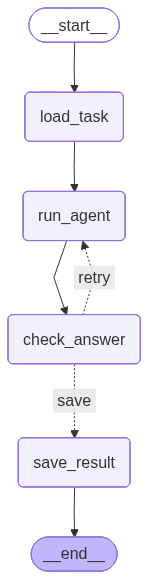

# Overview

## 1) Cos'e' questo progetto

Un esperimento controllato multi-agente su scenari 5G, orchestrato con LangGraph:

- due ruoli LLM (`expert` e `beginner`) rispondono agli stessi task
- due setup sperimentali (`1A` e `1B`) permettono di confrontare "stesso modello" vs "modelli diversi per ruolo"
- ogni task viene ripetuto piu' volte a temperatura 0 per misurare **consistenza**
- ogni run produce JSON di output + report aggregati in Markdown

---

## 2) Setup sperimentali, ruoli e cosa viene misurato

### Setup 1A vs 1B

- **1A**: `expert` e `beginner` usano lo **stesso modello** (controllo).
- **1B**: `expert` e `beginner` usano **modelli diversi** (confronto).

I modelli effettivi sono definiti in `config.py` (mapping `MODELS`).
Nota: se trovi riferimenti storici a modelli diversi nei documenti, fa fede `config.py`.

### Ruoli

I ruoli sono definiti dai system prompt in `agents/prompts.py`:

- `expert`: profilo ingegnere 5G senior
- `beginner`: profilo tecnico 5G junior

Formato di output richiesto ad entrambi:

```json
{
  "answer": "...",
  "reasoning": "...",
  "confidence": 0.0
}
```

### Task

I task sono in `docs/tasks/` e sono di due tipi:

- `math`: verifica numerica deterministica in Python (ground truth)
- `textual`: scoring tramite judge LLM con rubrica → l'agente produce una risposta testuale che viene valutata da un modello "giudice" (judge) che applica criteri di valutazione strutturati (rubrica) per assegnare un punteggio invece di confrontare semplicemente con una ground truth numerica

---

## 3) Mappa del codice (dove sta cosa)

- `main.py`: entrypoint CLI; itera esperimenti/ruoli/task/ripetizioni; genera report di evaluation
- `config.py`: mapping modelli + parametri globali (temperature, retry, ripetizioni, soglie)
- `utils/experiment_utils.py`: stato e grafo LangGraph; nodi `load_task`, `run_agent`, `check_answer`, `save_result`
- `utils/task_utils.py`: parsing dei metadata (`**ID:**`, `**Tipo:**`) e lettura dei JSON dai file `_sol.md`
- `agents/agent_runner.py`: chiamata LLM via Ollama + parsing robusto del JSON in output
- `agents/judge_agent.py`: chiamata LLM judge + parsing JSON + logging
- `core/checker.py`: valutazione deterministica dei task `math`
- `core/loop_controller.py`: regola di retry
- `core/result_writer.py`: scrittura dei risultati in `results/`
- `utils/evaluation_utils.py`: aggregazione risultati e generazione report in `results/evaluation/`

---

## 4) Formato dei task e delle soluzioni

### Scenario (`docs/tasks/<task>.md`)

Ogni scenario e' un Markdown che include (obbligatori):

- `**ID:** <task_id>`
- `**Tipo:** math | textual`

e contiene lo scenario e le istruzioni per produrre il JSON.

### Soluzione (`docs/tasks/<task>_sol.md`)

Il file `_sol.md` contiene blocchi JSON racchiusi in fenced code blocks ` ```json ... ``` `.

- **Blocco 1**: `ground_truth`
- **Blocco 2** (solo `textual`): rubrica + `total_max`

Il sistema carica questi JSON nello stato interno per la valutazione.

---

## 5) Flusso di esecuzione (LangGraph)

Per ogni combinazione (setup, ruolo, task, ripetizione) il runtime esegue:

1) `load_task`
- legge scenario + `_sol.md`
- ricava `task_id` e `task_type`
- carica `ground_truth` (e la rubrica se `textual`)

2) `run_agent`
- chiama l'LLM (Ollama) con system prompt del ruolo + testo del task
- salva il JSON dell'agente in `history` e in `final_answer`

3) `check_answer`
- `math`: confronto deterministico con `core/checker.py`
- `textual`: chiama il judge LLM con scenario + rubrica + risposta

4) retry o salvataggio
- se `verdict == "wrong"` e `attempts < MAX_RETRIES`, torna a `run_agent`
- altrimenti salva e termina

### Ripetizioni vs retry

- `REPETITIONS`: ripete lo stesso task per misurare **consistenza** a `TEMPERATURE = 0.0`
- `MAX_RETRIES`: tentativi dentro una singola ripetizione, solo se la valutazione e' `wrong`

### Export del grafo

```bash
python main.py --export-graph docs/graph.png
```



---

## 6) Valutazione: come si decide correct/wrong

### 6.1 Task `math` (deterministici)

La valutazione avviene in `core/checker.py` usando `ground_truth`:

- `type: exact_int`: conversione a int e match esatto (delta = 0)
- `type: real`: match float con `tolerance` (supporta anche answer come oggetto con piu' campi)

Output nel risultato:

- `verdict: correct | wrong`
- `judge_score`: contiene `delta` e una `note` descrittiva

### 6.2 Task `textual` (judge LLM) — approfondimento

Nei task textual il judge viene chiamato in `agents/judge_agent.py`.

**Input del judge** (payload JSON):

```json
{
  "scenario": "...",
  "rubrica": {"rubrica": {"...": "..."}, "total_max": 9},
  "agent_response": {"answer": "...", "reasoning": "...", "confidence": 0.0}
}
```

**Cosa NON riceve il judge**:

- il blocco `ground_truth` (quindi non fa un "match" diretto con la soluzione)

**Output atteso**:

- un JSON con campi `*_score` + `total_score` + `feedback` (come richiesto dal prompt in `agents/prompts.py`)

**Come si calcola il verdetto** (in `utils/experiment_utils.py`):

- se manca `total_score`, viene ricostruito sommando tutte le chiavi che finiscono con `_score`
- `correct` se `total_score >= total_max * TEXTUAL_PASS_RATIO`, altrimenti `wrong`

**Attenzioni importanti sui judge (semantica dei punteggi)**:

- *Allineamento rubrica ↔ prompt*: le rubriche per-task possono usare categorie diverse (es. `root_cause_score`),
  mentre il prompt del judge elenca un set fisso di score. Se non allineati, il judge puo' generare punteggi "standard"
  che non rappresentano davvero i criteri della rubrica.
- *Scala dei punteggi*: oggi non c'e' un vincolo che impone `0 <= total_score <= total_max`. Se il judge va "fuori scala",
  la soglia di pass/fail puo' diventare poco significativa.
- *Judge come fonte di verita'*: sui task textual, la rubrica e' di fatto la definizione operativa di "corretto".
  Se la rubrica e' ambigua o poco osservabile, il judge tende a premiare risposte plausibili.

---

## 7) Risultati: cosa viene salvato e come leggere i report

### File per ogni task e ripetizione

Per ogni ripetizione vengono scritti due file:

- `results/<experiment_id>/<role>/<task_id>_repN.json` (risultato completo)
- `results/<experiment_id>/<role>/<task_id>_repN_solution.json` (snapshot della ground truth)

Dentro il JSON di risultato (campi principali):

- metadati: `task_id`, `task_type`, `agent_role`, `model`, `repetition`
- esecuzione: `attempts`, `history`, `final_answer`, `verdict`, `judge_score`
- tempi: `started_at`, `finished_at`, `elapsed_seconds`

### Report aggregati (`results/evaluation/`)

Alla fine di una run, `utils/evaluation_utils.py` genera:

- `scores_1A.md`, `scores_1B.md`: accuracy, punteggi medi, confidence media, tentativi medi, breakdown per task,
  e una sezione su consistenza della reasoning tra ripetizioni
- `comparison.md`: confronto sintetico 1A vs 1B
- `consistency.md`: segnala differenze tra ripetizioni quando il JSON finale cambia

---

## 8) Dubbi (call) → situazione attuale → proposte future

### 8.1 Affidabilita' del judge sui task textual

- **Dubbio (call)**: il judge puo' validare risposte plausibili senza verifiche “hard”.
- **Situazione attuale**: per i textual il verdict dipende da punteggio del judge + soglia `total_max * TEXTUAL_PASS_RATIO`; la ground truth testuale non viene usata nel verdict.
- **Proposte future**: rubriche piu' osservabili, judge multipli (consenso) e/o controlli rule-based su KPI dove possibile.

### 8.2 Soglie e distinzione “lieve” vs “critica”

- **Dubbio (call)**: senza soglie esplicite il judge non discrimina bene classi vicine.
- **Situazione attuale**: i criteri sono nei task e nelle rubriche, ma la decisione finale resta LLM-based.
- **Proposte future**: rubriche con soglie numeriche e criteri uniformi tra task; prompt del judge che richiama esplicitamente quei criteri.

### 8.3 Mismatch tra rubriche per-task e schema output del judge

- **Dubbio (call)**: se il judge non segue la rubrica specifica, i punteggi diventano poco interpretabili.
- **Situazione attuale**: prompt judge con campi “standard”; rubriche dei task possono avere categorie diverse.
- **Proposte future**: generare dinamicamente il prompt dal JSON rubrica, oppure standardizzare tutte le rubriche su dimensioni fisse.

### 8.4 Retry con feedback povero

- **Dubbio (call)**: senza feedback il retry rischia di ripetere lo stesso errore.
- **Situazione attuale**: retry attivo solo su verdict `wrong`, ma il feedback del judge non viene reiniettato nel prompt.
- **Proposte future**: reiniettare `feedback` nel retry o aggiungere un nodo di “revision” prima del nuovo tentativo.

### 8.5 Campo `confidence` poco sfruttato

- **Dubbio (call)**: la confidence non incide sul verdetto e quindi non misura calibrazione.
- **Situazione attuale**: la confidence viene salvata e riportata come media nei report.
- **Proposte future**: metriche di calibrazione (penalita' per overconfidence) e score composito (accuracy × calibration).

### 8.6 Task troppo facili / differenze tra ruoli poco visibili

- **Dubbio (call)**: se l'accuracy satura, 1A vs 1B e expert vs beginner non si distinguono.
- **Situazione attuale**: task set piccolo (4 task) e spesso ben vincolato.
- **Proposte future**: task borderline e ambiguita' controllata, piu' casi e rubriche piu' discriminanti.

### 8.7 Token/costi/tempi non tracciati in modo completo

- **Dubbio (call)**: senza token/latency per chiamata non si confronta costo/qualita'.
- **Situazione attuale**: viene salvato `elapsed_seconds` a livello di ripetizione, non token in/out.
- **Proposte future**: token tracking (agent + judge) e report di costo/tempo per setup/ruolo/task.

### 8.8 Consistenza troppo basata su equality del JSON

- **Dubbio (call)**: il confronto stringente segnala inconsistenze anche quando il senso e' identico.
- **Situazione attuale**: consistenza rilevata confrontando il JSON finale tra ripetizioni.
- **Proposte future**: confronto semantico (embedding) sul reasoning e confronto separato su `answer`.

### 8.9 Modelli: taglia, stabilita' e latenza

- **Dubbio (call)**: hardware/VRAM e latenza influenzano scelta modello e stabilita' dei risultati.
- **Situazione attuale**: mapping in `config.py`, limite output con `OLLAMA_NUM_PREDICT`, timeout per ripetizione.
- **Proposte future**: profiling, confronto tra quantizzazioni/taglie e documentazione sistematica del modello usato per ogni run.

### 8.10 Lingua dei prompt e memoria condivisa

- **Dubbio (call)**: prompt IT vs EN e assenza di memoria condivisa possono cambiare performance.
- **Situazione attuale**: prompt in italiano; stato per task include `history` ma non persiste cross-task.
- **Proposte future**: A/B test lingua prompt e sperimentazione di memoria condivisa (state/file) + piu' task e judge multipli.
